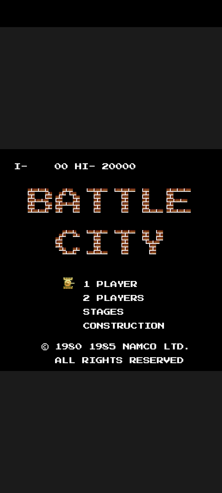
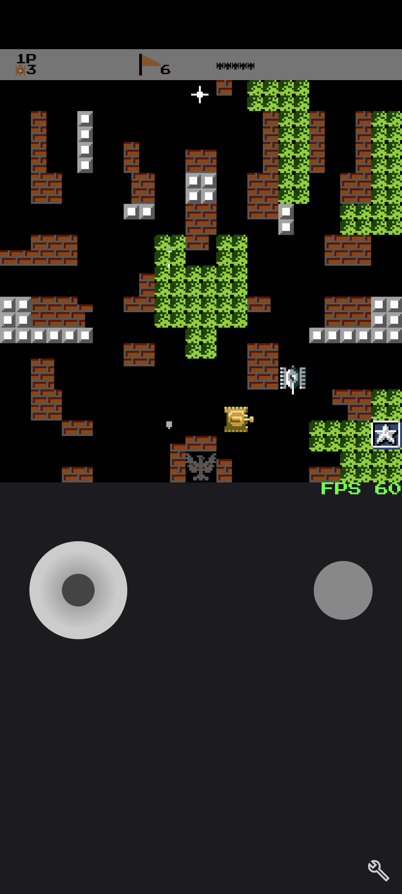
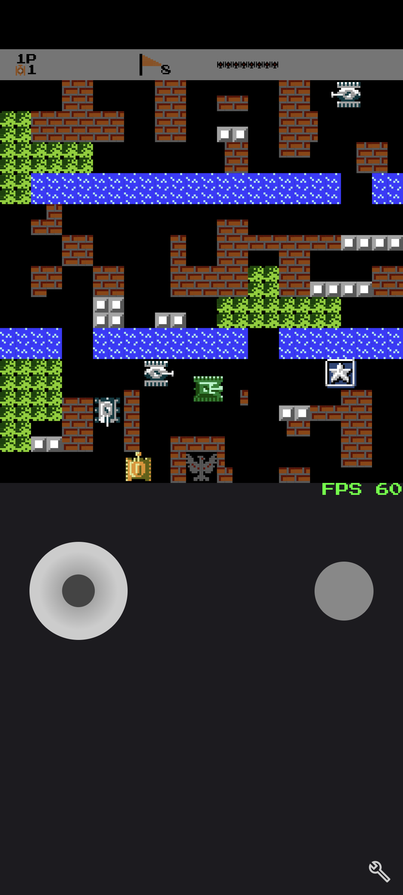
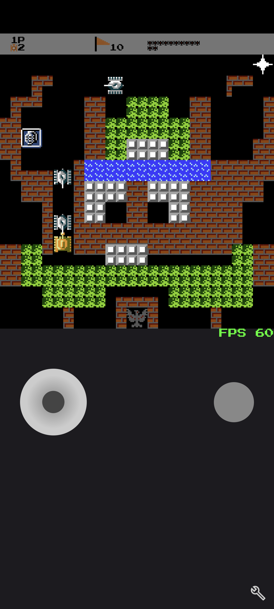
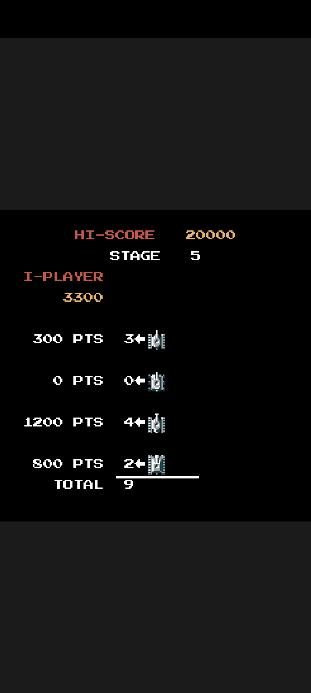
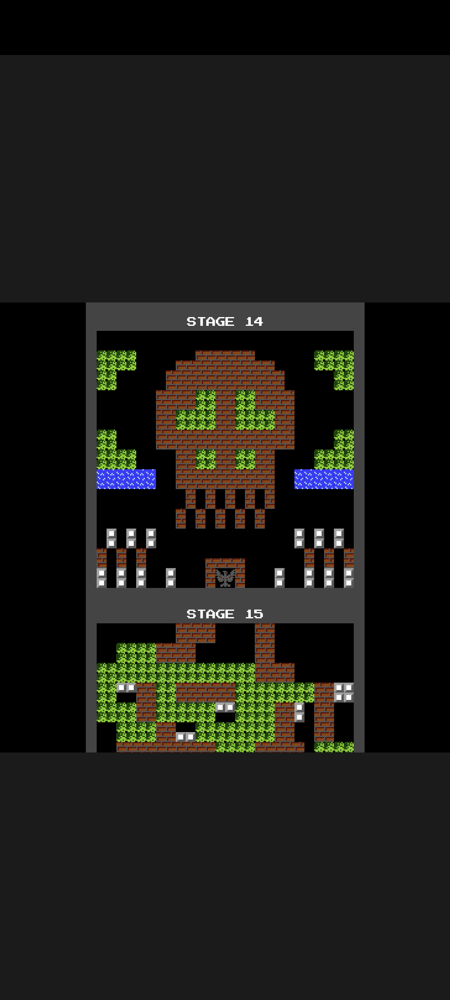
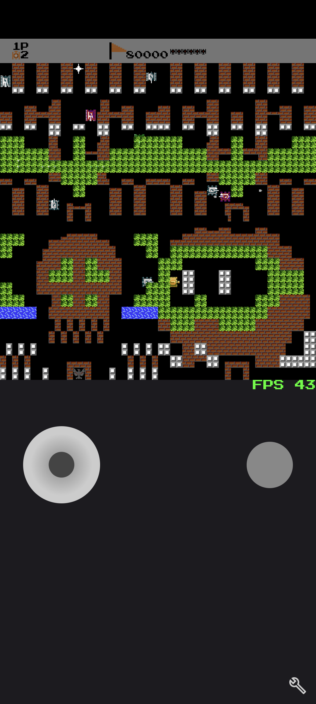
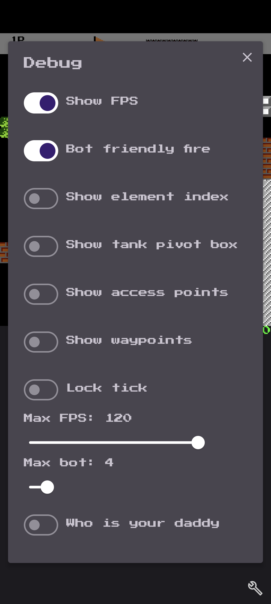
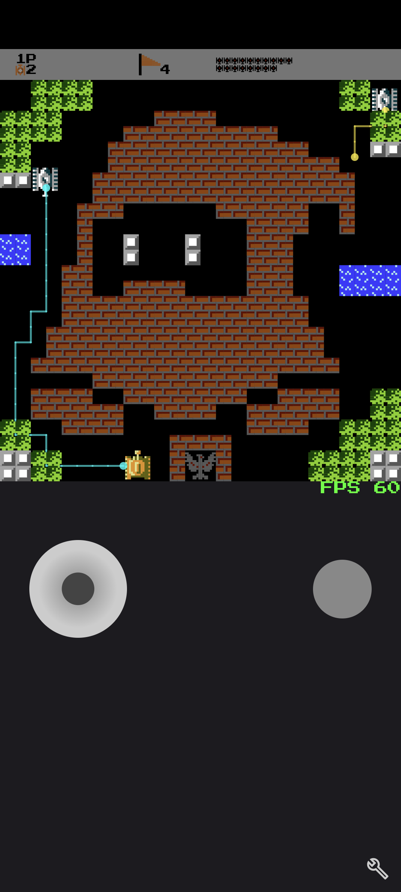
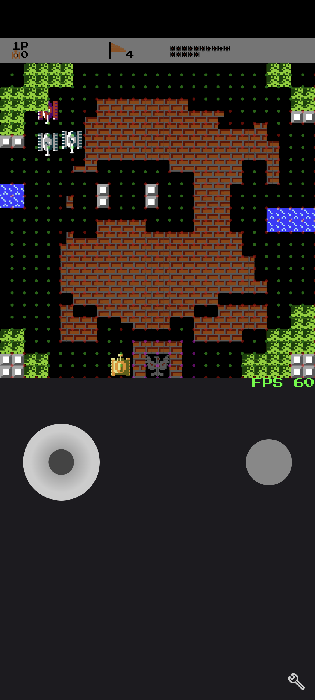

## Introduction
This game is a pixel-to-pixel clone of the classic NES game Battle City, made with Android Compose UI.

## Showcase Video (YouTube, 04:06)

## Screenshots
### Landing Page

### Gameplay1

### Gameplay2

### Gameplay3

### Scoreboard Screen

### Map Selection

### QuadMap

### Debug Panel

### Bot Waypoint

### Bot Access Point

## Features
[x] Joystick 

[x] Map elements

[x] Water animation

[x] Tank treads animation

[x] Bullet collision test

[x] Explosion animation

[x] Tank collision with map elements

[x] Tank collision with tanks

[x] Spawn blink

[x] Spawn shield

[*] Power-ups

[x] Drive on ice

[x] Debug control panel

[x] Map selection

[X] HUD

[x] Scoreboard

[X] Font

[x] Menu screens

[ ] Map editor

[X] AI

[x] N-in-1 Map

[ ] Online

## Details:
[x] bullets have aoe affect on surface.

[ ] collisions between bullets don't explode

[x] level 3+ shoots 2 bullets at a time

[x] level 4 bullets crack 1 layer of steel or 2 layers of brick

[x] all level 4 bots change color scheme simultaneously every 10 seconds (new version level 4 flashes.).

[x] ~~level 4 bots have different color schemes: (1) green -> yellow -> yellow -> gray -> die. (2) gray -> gray -> green -> gray -> die (obsolete)~~

[x] bots with power-up flash gray-red

[x] tank ui shadow direction

[x] shovel fortifies base for 18 secs, then it alternates 12 times for 3 more secs.

[x] collision with half bricks is buggy
